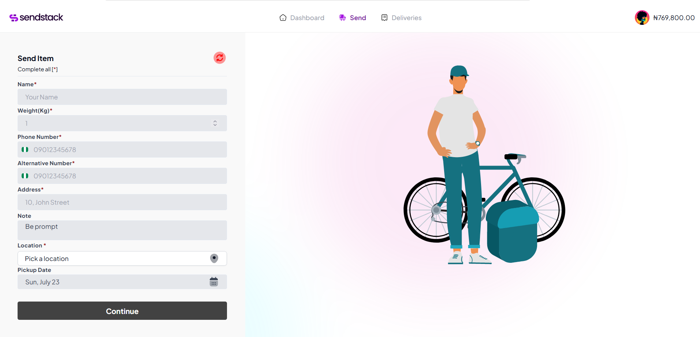

# SendStack Test

  
## Features

- Delivery Booking
- Delivery tracking
- Delivery history

## Libraries

- [Redux Toolkit](https://redux-toolkit.js.org/)
- [RTK Query](https://redux-toolkit.js.org/)
- [Tailwind CSS](https://tailwindcss.com/)
- [Shadcn](https://ui.shadcn.com/)
- [Headless UI](https://headlessui.com/)
- [Axios](https://axios-http.com/)

## Running the app

1. Clone the repository.
2. Install dependencies with `npm install`.
3. Run the development server with `npm run dev`.
4. Run the production server with `npm run start`.

## License

This project is licensed under the MIT License - see the [LICENSE.md](LICENSE.md) file for details.
